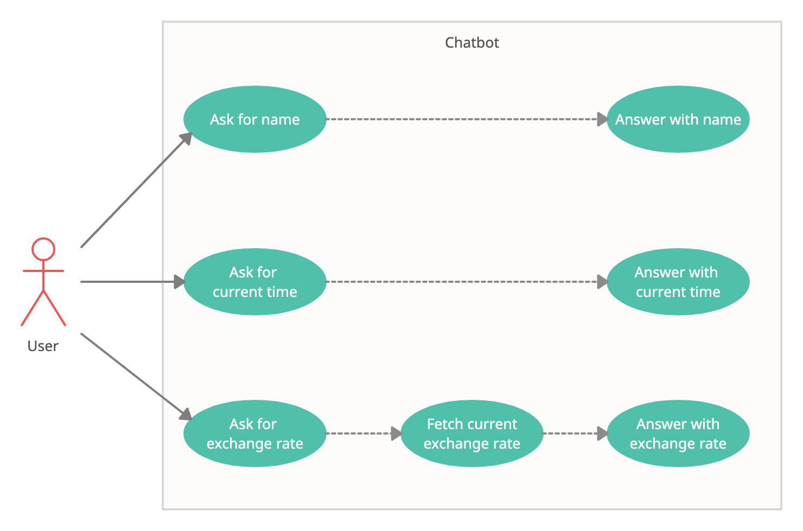

## Semestrální projekt v rámci předmětu STIN (softwarové inženýrství) Technické univerzity v Liberci

### Zadání:

Cílem tohoto projektu je chatbot, který by měl umět:

1) zpracovávat vstupní data (zprávy uživatelů)
2) vytvářet odpovědi na zprávy (odpovídat na dotazy uživatelů)

Formáty vstupních dat:

1) Otázka, jak se jmenuje tento bot (např. Q: "Jak se jmenujete?", A: "Ja se jmenuji bot.")
2) Otázka, kolik je hodin (např. Q: "Kolik je hodin?", A: "Teď je 12:30.")
3) Otázka, jaký je dnešní kurz eura (např. Q: "Jaký je dnešní kurz eura?", A: "Dnes je kurz eura 1,23.")

### Use case diagram:
